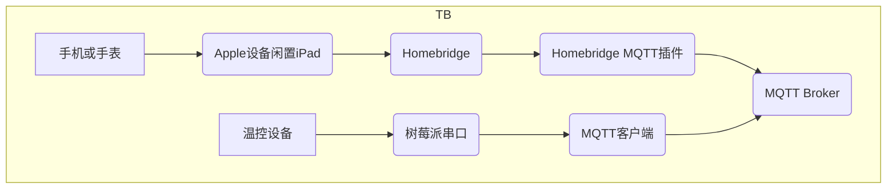
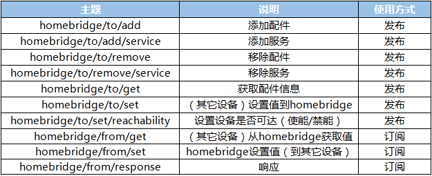

# 温控器

手机控制自定义的温控器。

## 设备

温控器本身以一个树莓派来实现。具有以下功能：

* 分区，如每个房间一个控制区域
* 每个区域能够设置温度
* 每个区域具有一个温度传感器
* 每个区域可以独立开关
* 具体功能由python实现和硬件设备实现


## 控制中心

运行homebridge的树莓派


## 控制端

iOS系统的Home和SIRI


## 方案

设备以及控制中心通过家庭局域网连接，协议MQTT




## 测试

安装homebridge，在树莓派或者其它计算机上安装mosquitto。

在树莓派上安装homebridge-mqtt：

```shell
sudo npm install -g homebridge-mqtt
```

homebridge-mqtt将Homekit的配件，服务的各种操作，映射成MQTT的Topic操作。支持的Topic有：




修改homebridge配置文件`/var/lib/homebridge/config.json`，添加：

```json
    "platforms": [
        {
            "platform": "mqtt",
            "name": "mqtt",
            "url": "mqtt://10.0.0.5",
            "topic_type": "multiple",
            "topic_prefix": "homebridge",
            "username": "rpi2-zerodayhong",
            "password": "rpi2rpi2"
        }
    ]
```


打开term，运行：

### 添加配件

```shell
# add accessory, pub
# topic: homebridge/to/add
# payload: {"name": "flex_lamp", "service_name": "light", "service": "Switch"}
mosquitto_pub -u rpi2-zerodayhong -P rpi2rpi2 -t homebridge/to/add -m '{"name": "flex_lamp", "service_name": "light", "service": "Switch"}'
```

以上操作会在Home中添加配件。

其中：

* name为唯一值，在mqtt中表示
* service_name，当一个配件支持多种service的时候，service_name区分
* service，Homekit定义的service种类


### 删除配件

```shell
# remove accessory, pub
# topic: homebridge/to/remove
# payload: {"name": "flex_lamp"}
mosquitto_pub -u rpi2-zerodayhong -P rpi2rpi2 -t homebridge/to/remove -m '{"name": "flex_lamp"}'
```

以上操作会在Home中删除配件。


### 设备设置值（to homebridge）

```shell
# set value (to homebridge), pub
# topic: homebridge/to/set
# payload: {"name": "flex_lamp", "service_name": "light", "characteristic": "On", "value": true}
mosquitto_pub -u rpi2-zerodayhong -P rpi2rpi2 -t homebridge/to/set -m '{"name": "flex_lamp", "service_name": "light", "characteristic": "On", "value": true}'
```

以上操作会设置配件的属性，比如在Home中显示灯的打开或关闭。


### 设备订阅“设置值”（from homebridge）

```shell
# set value (from homebridge), sub
# topic: homebridge/from/set
# payload: {"name": "flex_lamp", "service_name": "light", "characteristic": "On", "value": true/false}
mosquitto_sub -u rpi2-zerodayhong -P rpi2rpi2 -t homebridge/from/set
# click on Home App's accessory, respond:
# {"name":"flex_lamp","service_name":"light","characteristic":"On","value":false}
# {"name":"flex_lamp","service_name":"light","characteristic":"On","value":true}
```

以上操作会监听来自Homekit的设置信息，比如设备收到Home中的操作信息。


### 设备订阅“查询”（from homebridge）

```shell
# get value (from homebridge), sub
# topic: homebridge/from/get
# payload: {"name": "flex_lamp", "service_name": "light", "characteristic": "On"}
mosquitto_sub -u rpi2-zerodayhong -P rpi2rpi2 -t homebridge/from/get
# when open Home App, it refresh accessory, respond:
# {"name":"flex_lamp","service_name":"light","characteristic":"On"}
```

以上操作会监听来自Homekit的查询信息，比如设备收到Home中的刷新信息。


### 获取配件信息

```shell
# get accessory/accessories, pub
# topic: homebridge/to/get
# payload: {"name": "flex_lamp"}
mosquitto_pub -u rpi2-zerodayhong -P rpi2rpi2 -t homebridge/to/get -m '{"name": "flex_lamp"}'

# homebridge sends the accessory configuration to
# topic: homebridge/from/response
# payload: {"flex_lamp":{"services":{"light":"Switch"},"characteristics":{"light":{"On":false}}}}

# in another term:
mosquitto_sub -u rpi2-zerodayhong -P rpi2rpi2 -t homebridge/from/response
# the info will be something like this:
# {"flex_lamp":{"services":{"light":"Switch"},"characteristics":{"light":{"On":false}}}}

```


## 添加温控器

根据`HAP-NodeJS`的代码：

https://github.com/KhaosT/HAP-NodeJS/blob/master/lib/gen/HomeKitTypes.js

温控器的属性有：

```js
/**
 * Service "Thermostat"
 */

Service.Thermostat = function(displayName, subtype) {
  Service.call(this, displayName, '0000004A-0000-1000-8000-0026BB765291', subtype);

  // Required Characteristics
  this.addCharacteristic(Characteristic.CurrentHeatingCoolingState);
  this.addCharacteristic(Characteristic.TargetHeatingCoolingState);
  this.addCharacteristic(Characteristic.CurrentTemperature);
  this.addCharacteristic(Characteristic.TargetTemperature);
  this.addCharacteristic(Characteristic.TemperatureDisplayUnits);

  // Optional Characteristics
  this.addOptionalCharacteristic(Characteristic.CurrentRelativeHumidity);
  this.addOptionalCharacteristic(Characteristic.TargetRelativeHumidity);
  this.addOptionalCharacteristic(Characteristic.CoolingThresholdTemperature);
  this.addOptionalCharacteristic(Characteristic.HeatingThresholdTemperature);
  this.addOptionalCharacteristic(Characteristic.Name);
};
```


### 添加温控器

```shell
# add accessory, pub
# topic: homebridge/to/add
# payload: {"name": "flex_lamp", "service_name": "light", "service": "Switch"}
mosquitto_pub -u rpi2-zerodayhong -P rpi2rpi2 -t homebridge/to/add -m '{"name": "thermostat_livingroom", "service_name": "客厅温控器", "service": "Thermostat"}'
```


### 删除温控器

```shell
# remove accessory, pub
# topic: homebridge/to/remove
# payload: {"name": "thermostat_livingroom"}
mosquitto_pub -u rpi2-zerodayhong -P rpi2rpi2 -t homebridge/to/remove -m '{"name": "thermostat_livingroom"}'
```


### 模拟温度传感器

```shell
# set value (to homebridge), pub
# topic: homebridge/to/set
# payload: {"name": "flex_lamp", "service_name": "light", "characteristic": "On", "value": true}
mosquitto_pub -u rpi2-zerodayhong -P rpi2rpi2 -t homebridge/to/set -m '{"name": "thermostat_livingroom", "service_name": "客厅温控器", "characteristic": "CurrentTemperature", "value": 20}'
```


## 动态添加温控器

通过命令行添加温控器之后，如果系统（homebridge重启），温控器需要重新添加。可以让温控器设备自己动态添加。

1. 温控器启动
2. 通过`homebridge/to/get`主题和`homebridge/from/response`主题检查是否添加了温控器
3. 若未添加，则通过`homebridge/to/add`添加温控器配件
4. 通过pub `homebridge/to/set`来更新参数
5. 通过sub `homebridge/from/set`来监听传递的设置值
6. 由python实现以上功能。